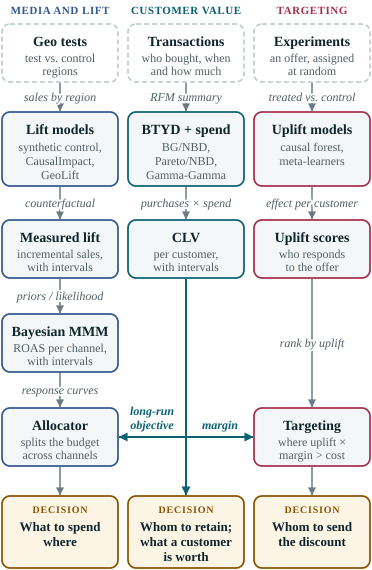

## Five days, five questions

1. **Day 1.** 
2. **Day 2.** 
3. **Day 3.** 
4. **Day 4.** 
5. **Day 5.** 

::: {.muted}
Module 0 () is optional pre-work before Day 1.
:::

## Every module ends in a decision

::: {.lead}
Statistics for marketing is only useful if it changes what someone does on Monday.
:::

::: {.decision-box}
Whom to retain · what a customer is worth · what to spend where · whom to send the discount
:::

- Each lab closes with its decision cell, made from your own results.
- The same retailer and its data come back all week, so each method is measured against the one before it on the same customers.

## The path

:::: {.columns}
::: {.column width="50%"}
0. 
1. 
2. 
3. 
4. 
5. 
6. 
:::

::: {.column width="50%"}
7. 
8. 
9. 
10. 
11. 
12. 
:::
::::

::: {.muted}
Each step fixes a failure of the one before it.
:::

## How the parts connect

:::: {.columns}
::: {.column width="45%" .integration-img}
{fig-alt="Three lanes ending in decisions: geo tests to measured lift to a Bayesian MMM to the allocator; transactions to BTYD and Gamma-Gamma to CLV; experiments to uplift models to targeting. CLV feeds the allocator's long-run objective and the targeting margin."}
:::

::: {.column width="55%"}
- **Customer value** (middle): transactions → BTYD and Gamma-Gamma → CLV.
- **Media and lift** (left): geo tests → measured lift → priors or likelihood for the MMM → the allocator.
- **Targeting** (right): experiments → uplift models → who gets the offer.
- **CLV connects them:** the allocator's long-run objective and the targeting margin.
:::
::::

## How a module runs

::: {.shape}
[Briefing]{.shape-briefing}[Lab in Colab]{.shape-lab}[Debrief]{.shape-debrief}
:::

- **Briefing:** why the method is needed, and how it works, at the depth you need to use and check it.
- **Lab:** you build it in a notebook. **Debrief:** the room compares results and states the decision.

::: {.tiles}
1. **Predict** what a cell will show. Write it down.
2. **Run** it.
3. **Explain** the result, especially a surprise.
4. **Check** it against a checkpoint, often against the known truth.
:::

## Working in the labs

- Each exercise is a function **stub** with its **solution folded** beneath it. Try first; open the solution when you are stuck.
- A **checkpoint** after each exercise passes or fails and says whose code it checked: yours or the reference.
- Stuck on exercise N: run its solution cell, then [workshop.use_reference(N)]{.checkpoint} (Python) or [use_reference(N)]{.checkpoint} (R), and carry on.
- **Run all** stops at the first exercise you have not written. `WORKED_EXAMPLE` runs the whole lab on the reference solutions.
- The **stretch** section at the end is optional. Nothing later depends on it.

## The honesty rules

- **The readiness page says what has run.** Where, when, with which settings. A run time appears only if a run record exists, and a laptop or CI run is never shown as a Colab run.
- **Ground truth first.** Synthetic data come from seeded generators with known parameters. Checkpoints compare your estimate with the truth using a named interval, such as a 94% highest density interval.
- **No invented facts.** Every reference was fetched and is dated. No made-up statistics, people or quotes. When we do not know, we say so.

## Setup: nothing to install

- Every lab runs in **Google Colab**, in the browser. You need a Google account.
- Most labs are Python; some modules add an **R notebook** where R has the reference implementation.
- The install cell installs the package versions the labs were tested with. If it asks you to restart the session, restart, then **Run all** again.
- Prefer your own machine? The [Setup](../setup.qmd) page covers the workshop's Docker image.

## Logistics

- Each day starts at  with a warm-up and ends with a wrap-up; the breaks and lunch are on the [schedule](../schedule.qmd).
- Days 2 and 3 have an afternoon clinic on that day's decision.
- Day 5 ends with the capstone: pairs build one decision pipeline and present a short brief.

**Where everything is**

- The site: [](). [Notebooks](../notebooks.qmd): every lab, one click to Colab.
- [FAQ](../faq.qmd) and [Readiness](../readiness.qmd): what to do when Colab misbehaves, and what has run where.

## Next

::: {.lead}
Module 1 · 
:::


